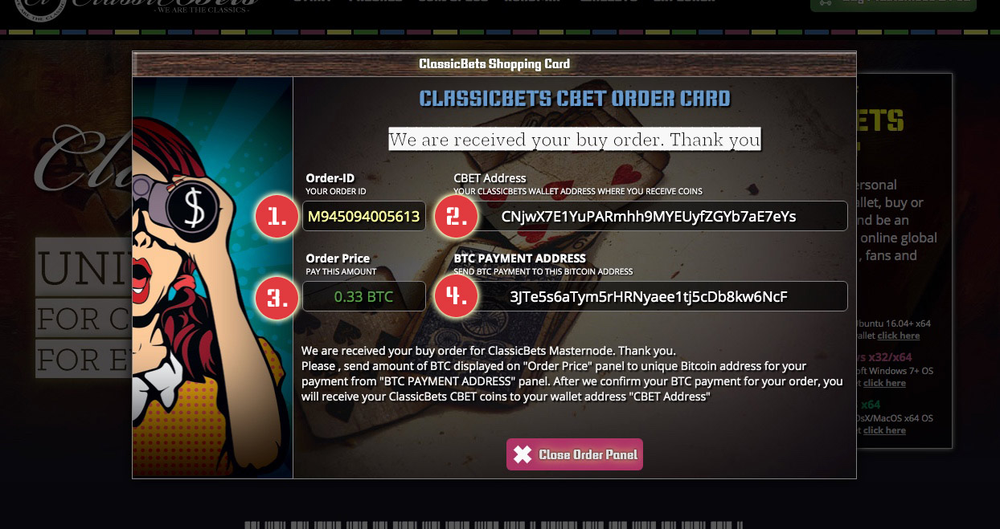

How To : Buy Masternode or Staking package
===========

This is the step-by-step manual, how you can buy full ClassicBets Masternode or Staking Package in Presale.

**Step 1**
------------

a) Download ClassicBets Desktop wallet for first. Synchronize wallet and **generate new wallet** address 
in ```menu->receiving addresses``` or your can create one via receive tab in wallet. 
You will need this address in next steps !

b) Open ClassicBets website in your browser ( https://classicbets.net )

**Step 2**
-----------


a) Click to button "Buy Masternode & Pos" **[Point.1/Scr.1]** in right top corner of website, or to
"Buy your Masternode or Staking package" button located on presale tab **[Point.2/Scr.2]**

b) It will open for you ClassicBets buy order card **[Scr.3]**

**Step 3**
-----------


a) Select which package you want to buy.**[Point.1/Scr.1]** You can select between Full ClassicBets Masternode 
(3333.30 CBET coins for 0.267 BTC) or ClassicBets Staking Package (333.00 CBET coins for 0.0267 BTC)

b) Provide your wallet address from **Step-1** where you want to receive your bought CBET coins **[Point.2/Scr.1]**

c) Provide to us your email address where you receive confirmation of your order **[Point.3/Scr.1]**

d) Click to "Continue with Order" button **[Point.4/Scr.1]**

**Step 4**
----------



You will receive confirmation email about your order after last **Step-3**

a) Copy Your ```Order-ID``` for future purposes ( if security reasons ) **[Point.1/Scr.1]**

b) There is your wallet address where you receive your CBET coins **[Point.2/Scr.1]**

c) In this field you can see the price of bought package in BTC **[Point.3/Scr.1]**

d) In field **[Point.4/Scr.1]** is your unique BTC address, where you must send your payment for bought package


**Importnant notice :**
- Please , give to us up to few hours to process your payment. Thank you
- All sales (MN/PoS) will be published under #presale-track channel on our Discord
